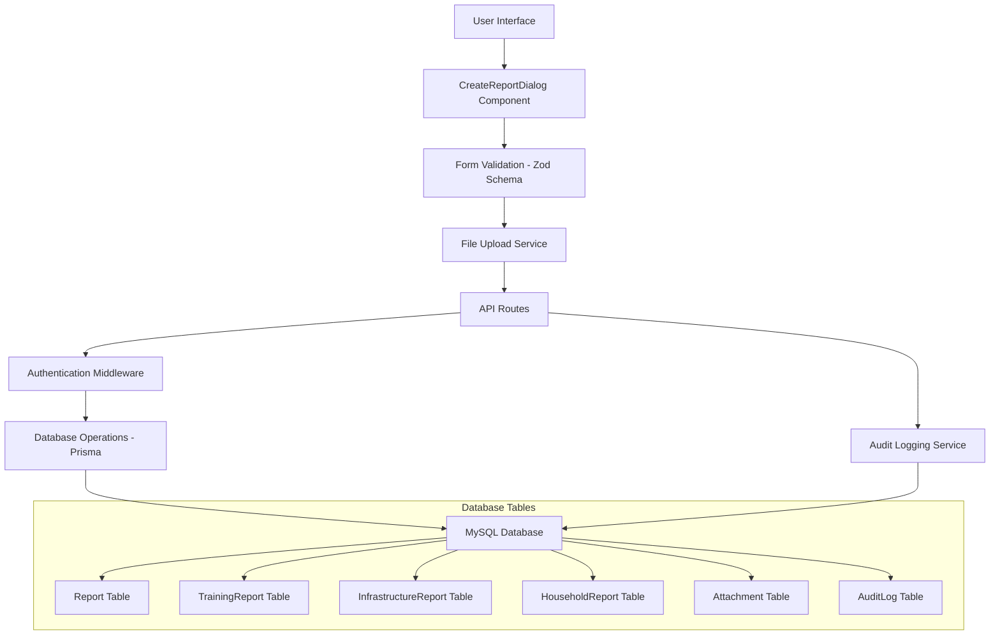

# Report Creation System Documentation

## Table of Contents
1. [Overview](#overview)
2. [Report Types](#report-types)
3. [System Architecture](#system-architecture)
4. [Report Creation Workflow](#report-creation-workflow)
5. [Database Schema](#database-schema)
6. [API Endpoints](#api-endpoints)
7. [Frontend Components](#frontend-components)
8. [File Upload System](#file-upload-system)
9. [Validation Rules](#validation-rules)
10. [Security & Authorization](#security--authorization)
11. [Audit Logging](#audit-logging)
12. [Error Handling](#error-handling)
13. [Usage Examples](#usage-examples)

## Overview

The Report Creation System in MIS-tanx-nextjs is a comprehensive feature that allows organizations to document project activities, track interventions, and measure outcomes. The system supports multiple report types with dynamic form fields, file attachments, and specialized data structures for different activity types.

### Key Features
- Multi-type report creation (Training, Infrastructure, Household, PI-only)
- Hierarchical location-based reporting (State, District, Block, Village)
- File upload support with evidence and report attachments
- Dynamic form validation based on report type
- Participant management for training reports
- Infrastructure progress tracking with photo documentation
- Household beneficiary tracking with benefit details
- Leverage source tracking (Government, CSR, Community)
- Real-time form validation and error handling
- Audit logging for compliance and tracking

## Report Types

The system supports four main report types, each with specialized fields and validation rules:

### 1. Training Reports
- **Purpose**: Document training sessions and workshop activities
- **Special Fields**:
  - Training date range (from/to)
  - Participant management (name, age, gender, education, etc.)
  - Number of people validation (must match participant count)
- **Validation**: Requires at least 1 participant with complete details

### 2. Infrastructure Reports
- **Purpose**: Track infrastructure development projects
- **Special Fields**:
  - Infrastructure name and category
  - Work type and DPR approval status
  - Budget tracking (sanctioned vs. expenses incurred)
  - Photo documentation (pre, during, post construction)
  - Technical specifications and benefits
- **Validation**: Requires infrastructure-specific details

### 3. Household Reports
- **Purpose**: Document household-level interventions and benefits
- **Special Fields**:
  - Beneficiary demographics (name, age, gender, social group)
  - Household composition (male/female/total members)
  - Benefit tracking with custom benefit types
- **Validation**: Requires beneficiary information

### 4. PI-only Reports
- **Purpose**: General activity reporting without specialized fields
- **Special Fields**: Standard reporting fields only
- **Validation**: Basic field validation

## System Architecture



## Report Creation Workflow

The report creation process follows a structured multi-step workflow:

### Step 1: Project & Activity Selection
1. User selects a project from available projects
2. System loads interventions for the selected project
3. User selects an intervention
4. System loads sub-interventions for the selected intervention
5. User selects a sub-intervention
6. System loads activities for the selected sub-intervention
7. User selects an activity (determines report type)

### Step 2: Location & Timing Configuration
1. User selects level of activity (State/District/Block/Village)
2. System filters intervention areas based on selected level
3. User selects specific intervention area
4. User sets activity date and reporting period
5. System auto-calculates quarter and financial year

### Step 3: Activity Details Entry
1. User enters unit reported and number of people (if applicable)
2. User provides location details and GPS coordinates
3. User documents leverage sources and amounts
4. Form dynamically shows fields based on activity type

### Step 4: Type-Specific Data Entry
**For Training Reports:**
- Enter training date range
- Add participant details (auto-generated based on number of people)
- Fill participant information (name, age, gender, education, etc.)

**For Infrastructure Reports:**
- Enter infrastructure details (name, category, work type)
- Provide budget information (sanctioned vs. incurred expenses)
- Upload construction photos (pre, during, post)
- Document technical specifications

**For Household Reports:**
- Enter beneficiary demographics
- Document household composition
- Add benefit details with custom benefit types

### Step 5: File Attachments
1. Upload evidence files (photos, documents)
2. Upload report files (attendance sheets, etc.)
3. System processes uploads and stores URLs

### Step 6: Validation & Submission
1. Form validates all required fields
2. Type-specific validation runs
3. File uploads complete
4. Report created in database
5. Related records created (training participants, etc.)
6. Audit log entry created
7. Success notification displayed

## Database Schema

### Core Report Table
```sql
CREATE TABLE Report (
    id VARCHAR(191) PRIMARY KEY,
    organizationId VARCHAR(191) NOT NULL,
    projectId VARCHAR(191) NOT NULL,
    activityId VARCHAR(191) NOT NULL,
    interventionAreaId VARCHAR(191) NOT NULL,
    creatorId VARCHAR(191) NOT NULL,
    type ENUM('Training', 'Infrastructure', 'Household', 'PI-only') NOT NULL,
    status ENUM('DRAFT', 'SUBMITTED', 'APPROVED', 'REJECTED') DEFAULT 'DRAFT',
    levelofActivity ENUM('state', 'district', 'blockName', 'villageName') NOT NULL,
    reportingDate DATETIME(3) NOT NULL,
    reportingMonth VARCHAR(191) NOT NULL,
    reportingQuarter VARCHAR(191) NOT NULL,
    reportingYear VARCHAR(191) NOT NULL,
    landscape TEXT,
    gpsCoordinates TEXT,
    unitType VARCHAR(191),
    unitReported INT DEFAULT 0,
    numberOfPeople INT,
    hasLeverage BOOLEAN DEFAULT false,
    leverageSources TEXT,
    leverageGovt DECIMAL(10,2),
    leverageCsr DECIMAL(10,2),
    leverageCommunity DECIMAL(10,2),
    createdAt DATETIME(3) DEFAULT CURRENT_TIMESTAMP(3),
    updatedAt DATETIME(3)
);
```

### Related Tables
- **TrainingReport**: Stores training-specific data and participants
- **InfrastructureReport**: Stores infrastructure project details
- **HouseholdReport**: Stores household beneficiary information
- **Attachment**: Stores file upload metadata
- **AuditLog**: Tracks all report operations

## API Endpoints

### Create Report
**Endpoint**: `POST /api/reports`

**Authentication**: Required (JWT session)

**Request Body**:
```json
{
  "projectId": "string",
  "interventionId": "string", 
  "subInterventionId": "string",
  "activityId": "string",
  "levelofActivity": "state|district|blockName|villageName",
  "reportingDate": "2024-01-15T00:00:00.000Z",
  "reportingMonth": "January",
  "reportingQuarter": "Q4",
  "reportingYear": "FY24",
  "interventionAreaId": "string",
  "location": "string",
  "gpsCoordinates": "string",
  "unitReported": 100,
  "numberOfPeople": 25,
  "hasLeverage": true,
  "leverageSources": ["Government", "CSR"],
  "leverageGovt": 50000,
  "leverageCsr": 25000,
  "leverageCommunity": 0,
  "attachments": [
    {
      "type": "EVIDENCE",
      "url": "https://cloudinary.com/...",
      "filename": "evidence_file.jpg",
      "originalName": "Evidence Photo.jpg"
    }
  ],
  // Training-specific fields
  "trainingDateFrom": "2024-01-15T00:00:00.000Z",
  "trainingDateTo": "2024-01-17T00:00:00.000Z",
  "participants": [
    {
      "name": "John Doe",
      "age": 30,
      "gender": "Male",
      "education": "Graduate",
      "socialGroup": "General",
      "designation": "Farmer",
      "organization": "Local Cooperative",
      "mobile": "+91-9876543210",
      "email": "john.doe@example.com",
      "isPwd": false
    }
  ],
  // Infrastructure-specific fields
  "infrastructureName": "Community Center",
  "category": "Building",
  "workType": "New Construction",
  "dprApproved": true,
  "approvedDesignFollowed": true,
  "sanctionBudget": 500000,
  "expensesIncurred": 350000,
  "workDescription": "Construction of community center...",
  // Household-specific fields  
  "beneficiaryName": "Jane Smith",
  "age": 35,
  "gender": "Female",
  "socialGroup": "SC",
  "maleMembers": 2,
  "femaleMembers": 3,
  "totalMembers": 5,
  "benefits": [
    {
      "name": "Water Connection",
      "unitType": "Number",
      "reportedNumber": 1
    }
  ]
}
```

**Response**:
```json
{
  "id": "report_id_123",
  "organizationId": "org_id",
  "projectId": "project_id", 
  "status": "DRAFT",
  "type": "Training",
  "createdAt": "2024-01-15T10:30:00.000Z",
  "trainingReport": {
    "id": "training_report_id",
    "participants": [...]
  },
  "attachments": [...]
}
```

### Get Reports
**Endpoint**: `GET /api/reports`

**Authentication**: Required

**Response**: Array of reports with related data

### Update Report  
**Endpoint**: `PUT /api/reports/[reportId]`

**Authentication**: Required

**Request Body**: Same as create, with updated fields

### Delete Report
**Endpoint**: `DELETE /api/reports/[reportId]`

**Authentication**: Required

**Response**: 204 No Content

## Frontend Components

### CreateReportDialog Component
**Location**: `/app/org-dashboard/reports/components/create-report-dialog.tsx`

**Key Features**:
- Dynamic form schema based on activity type
- Hierarchical dropdown selections
- File upload integration
- Real-time validation
- Participant management for training reports
- Auto-calculation of reporting quarters
- Location-based filtering

**Props**:
```typescript
interface CreateReportDialogProps {
  onReportCreated?: () => void;
  reportId?: string; // For edit mode
  mode?: 'create' | 'edit';
}
```

### Form Schema (Zod Validation)
The form uses dynamic Zod schemas that adapt based on the activity type:

```typescript
const createFormSchema = (activityType?: string) => {
  return z.object({
    // Base fields for all reports
    projectId: z.string().min(1, "Project is required"),
    activityId: z.string().min(1, "Activity is required"),
    levelofActivity: z.enum(["state", "district", "blockName", "villageName"]),
    reportingDate: z.date({ required_error: "Activity date is required" }),
    unitReported: z.number().min(0, "Unit reported must be positive"),
    
    // Conditional fields based on activity type
    numberOfPeople: activityType === "Training" 
      ? z.number().min(1, "Number of people is required for training activities")
      : z.number().optional(),
    
    trainingDateFrom: activityType === "Training" 
      ? z.date({ required_error: "Training start date is required" })
      : z.date().optional(),
    
    // ... other conditional fields
  });
};
```

## File Upload System

### Upload Process
1. Files are uploaded to `/api/upload` endpoint
2. Files are processed and stored (likely Cloudinary integration)
3. Upload service returns URL and metadata
4. URLs are included in report creation request

### File Types Supported
- **Evidence Files**: Photos, documents supporting the activity
- **Report Files**: Attendance sheets, official documents
- **Infrastructure Photos**: Pre, during, and post-construction images

### Upload Validation
- File size limits enforced
- File type restrictions based on content type
- Secure file handling and storage

## Validation Rules

### Global Validation
- All required fields must be filled
- Date validations (past dates allowed, future dates restricted)
- Numeric field validations (positive numbers, decimal places)
- Email format validation where applicable

### Training Report Validation
- Number of people must be at least 1
- Training date range is required
- Participant count must match number of people
- Each participant requires name, age, and gender

### Infrastructure Report Validation
- Infrastructure name and category required
- Budget fields must be positive numbers
- Photo uploads encouraged but not mandatory

### Household Report Validation
- Beneficiary name and demographics required
- Household composition numbers must be consistent
- Benefits can be optional

## Security & Authorization

### Authentication
- User must be authenticated via NextAuth.js
- Session validation on all API endpoints
- JWT token verification

### Authorization
- User must belong to an active organization
- Reports can only be created for user's organization
- Users can only view/edit reports from their organization

### Data Protection
- Input sanitization for all form fields
- SQL injection prevention via Prisma ORM
- File upload security with type validation

## Audit Logging

### Audit Trail
All report operations are logged with:
- User ID and organization ID
- Action type (CREATE, UPDATE, DELETE)
- Resource type and ID
- IP address and user agent
- Timestamp

### Audit Log Schema
```sql
CREATE TABLE AuditLog (
    id VARCHAR(191) PRIMARY KEY,
    organizationId VARCHAR(191) NOT NULL,
    userId VARCHAR(191),
    action VARCHAR(191) NOT NULL,
    resource VARCHAR(191) NOT NULL,
    resourceId VARCHAR(191) NOT NULL,
    ipAddress VARCHAR(191),
    userAgent TEXT,
    timestamp DATETIME(3) NOT NULL
);
```

## Error Handling

### Client-Side Error Handling
- Form validation errors displayed inline
- File upload errors with retry options
- Network error handling with user feedback
- Toast notifications for success/error states

### Server-Side Error Handling
- Comprehensive try-catch blocks
- Detailed error logging
- Graceful error responses
- Database transaction rollbacks on failure

### Common Error Scenarios
1. **Validation Errors**: Missing required fields, invalid data types
2. **Upload Errors**: File size exceeded, unsupported file types
3. **Database Errors**: Constraint violations, connection issues
4. **Authorization Errors**: Insufficient permissions, expired sessions

## Usage Examples

### Creating a Training Report
```typescript
// 1. Select project and activity
const formData = {
  projectId: "proj_123",
  interventionId: "int_456", 
  subInterventionId: "sub_789",
  activityId: "act_101", // Activity type = "Training"
  levelofActivity: "district",
  
  // 2. Set timing and location
  reportingDate: new Date("2024-01-15"),
  reportingMonth: "January",
  reportingQuarter: "Q4", // Auto-calculated
  reportingYear: "FY24",
  interventionAreaId: "area_202",
  
  // 3. Activity details
  unitReported: 1, // One training session
  numberOfPeople: 25,
  
  // 4. Training-specific fields
  trainingDateFrom: new Date("2024-01-15"),
  trainingDateTo: new Date("2024-01-17"),
  participants: [
    {
      name: "John Doe",
      age: 30,
      gender: "Male",
      education: "Graduate",
      // ... other participant fields
    }
    // ... 24 more participants
  ],
  
  // 5. File attachments
  attachments: [
    {
      type: "EVIDENCE",
      url: "https://cloudinary.com/training_photo.jpg",
      filename: "training_evidence.jpg",
      originalName: "Training Session Photo.jpg"
    }
  ]
};

// Submit to API
const response = await fetch("/api/reports", {
  method: "POST",
  headers: { "Content-Type": "application/json" },
  body: JSON.stringify(formData)
});
```

### Creating an Infrastructure Report
```typescript
const infrastructureReportData = {
  // Base fields...
  projectId: "proj_123",
  activityId: "act_infrastructure", // Activity type = "Infrastructure"
  
  // Infrastructure-specific fields
  infrastructureName: "Village Community Center",
  category: "Public Building",
  workType: "New Construction",
  dprApproved: true,
  approvedDesignFollowed: true,
  sanctionBudget: 500000,
  expensesIncurred: 350000,
  workDescription: "Construction of multi-purpose community center...",
  
  // Photo documentation
  preConstructionPhotos: [
    {
      url: "https://cloudinary.com/pre_construction.jpg",
      publicId: "pre_const_001",
      originalName: "Site Before Construction.jpg"
    }
  ],
  duringConstructionPhotos: [...],
  postConstructionPhotos: [...]
};
```

This documentation provides a comprehensive guide to understanding and using the report creation system in MIS-tanx-nextjs. The system is designed to be flexible, secure, and user-friendly while maintaining data integrity and providing detailed audit trails for compliance purposes.