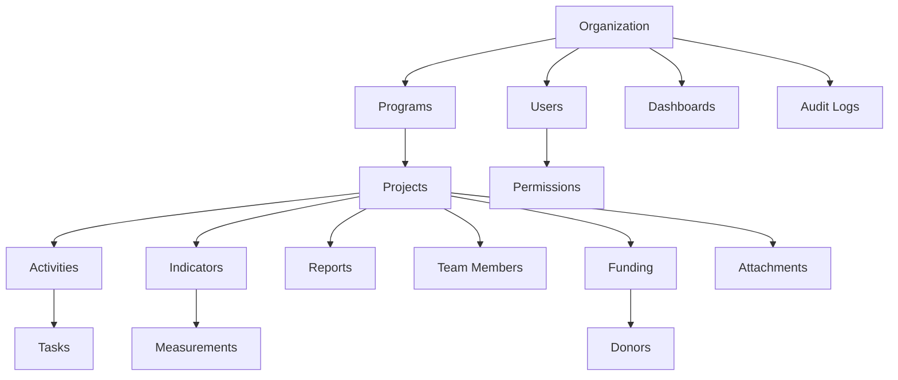

# User Journey - Monitoring & Evaluation Software

## 1. Organization Setup & Management

### Initial Setup
1. Organization Registration
   - Create organization profile with basic details (name, type, contact info)
   - Set up organization settings (timezone, date format, currency)
   - Configure branding and customization options

### User Management
1. User Onboarding
   - Admin creates user accounts
   - Users receive invitations
   - Users complete profile setup
   
2. Role Assignment
   - Assign organization roles (NGO Admin, MEL, Program Department, etc.)
   - Configure permissions for each role
   - Set up access controls for different resources

## 2. Program & Project Management

### Program Setup
1. Program Creation
   - Define program details (name, objectives, timeline)
   - Set budget and priority levels
   - Assign sector and theme
   - Link to organizational goals

### Project Management
1. Project Initialization
   - Create project under program
   - Define project code and basic details
   - Set timeline and budget
   - Specify beneficiary targets

2. Project Planning
   - Define project objectives
   - Create activity plans
   - Set up team structure
   - Establish donor relationships
   - Configure project funding

## 3. Monitoring Framework Setup

### Indicator Management
1. Indicator Definition
   - Create indicators (Output, Outcome, Impact levels)
   - Set up data collection methods
   - Define measurement frequencies
   - Establish baselines and targets

2. Results Framework
   - Define logical framework
   - Link objectives to indicators
   - Set up verification methods
   - Document assumptions

### Activity Planning
1. Activity Setup
   - Create detailed activity plans
   - Link activities to indicators
   - Set up attendance tracking
   - Configure PI data requirements

## 4. Data Collection & Monitoring

### Field Data Collection
1. Activity Implementation
   - Record activity progress
   - Track attendance
   - Collect PI data
   - Document leverage achieved

### Indicator Tracking
1. Measurement Recording
   - Input indicator measurements
   - Track progress against targets
   - Record location-specific data
   - Add measurement notes

## 5. Task Management

### Task Workflow
1. Task Creation
   - Create and assign tasks
   - Set priorities and deadlines
   - Link tasks to projects/activities
   - Track task status

2. Task Monitoring
   - Update task progress
   - Add attachments
   - Mark completion
   - Review task history

## 6. Reporting & Analysis

### Report Generation
1. Report Creation
   - Select report type
   - Define reporting period
   - Choose report template
   - Input report content

2. Report Workflow
   - Submit for review
   - Approve reports
   - Publish reports
   - Share with stakeholders

### Dashboard Management
1. Dashboard Setup
   - Create custom dashboards
   - Configure widgets
   - Set up filters
   - Share with team members

## 7. Compliance & Documentation

### Document Management
1. File Handling
   - Upload project documents
   - Manage attachments
   - Organize by category
   - Control access permissions

### Audit Trail
1. Activity Tracking
   - Log user actions
   - Track system changes
   - Monitor access patterns
   - Generate audit reports

## 8. System Integration & Communication

### Notifications
1. Alert System
   - Receive task notifications
   - Get deadline reminders
   - Review system updates
   - Track report status changes

### User Sessions
1. Access Management
   - Manage active sessions
   - Track login history
   - Monitor system usage
   - Ensure security compliance

## Data Flow & Relationships

## Key Integration Points

1. **Organization → Programs → Projects**
   - Hierarchical structure for program management
   - Cascading objectives and indicators
   - Unified reporting framework

2. **Projects → Activities → Tasks**
   - Operational workflow management
   - Progress tracking
   - Resource allocation

3. **Indicators → Measurements → Reports**
   - Data collection pipeline
   - Progress monitoring
   - Impact assessment

4. **Users → Permissions → Resources**
   - Access control
   - Role-based permissions
   - Security management

## Success Metrics

1. **Project Management**
   - Project completion rates
   - Budget utilization
   - Timeline adherence

2. **Monitoring & Evaluation**
   - Indicator achievement rates
   - Data quality scores
   - Reporting compliance

3. **User Engagement**
   - System adoption rates
   - Task completion times
   - User satisfaction levels

4. **Compliance & Documentation**
   - Audit compliance
   - Documentation completeness
   - Report submission rates 